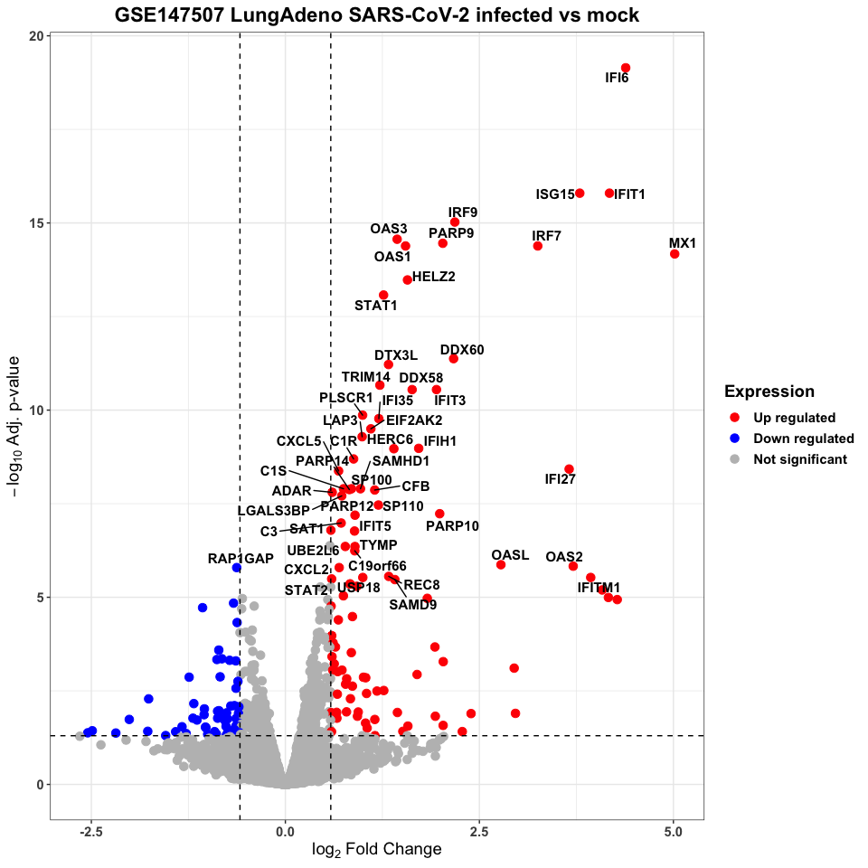

# GSE147507 SARS-CoV-2 Infection of Lung Cell Lines
[GSE147507](https://www.ncbi.nlm.nih.gov/geo/query/acc.cgi?acc=GSE147507) SARS-Cov-2 Dataset from tenOever lab at the Icahn School of Medicine at Mt. Sinai

See also the associated bioRxiv submission: [SARS-CoV-2 launches a unique transcriptional signature from in vitro, ex vivo, and in vivo systems](https://doi.org/10.1101/2020.03.24.004655)

This is a breif analysis of SARS-CoV-2 infection of some lung cell lines, primary human bronchial epithelial cells (NHBE), and Lung adenocarcinoma (A549).

Differential gene expression was determined using the Bioconductor package, limma, and represented as a Volcano plot, labeling the first 50 differentially expressed genes.

There are three comparisons:

Primary human bronchial epithelial cells (NHBE) infected with SARS-CoV-2 vs mock infection (three samples per group)

Here are the top 100 genes in a report from string-db, indicating inflammation, cellular recruitment, as well as an interferon response

Lung adenocarcinoma cells (A549) infected with SARS-CoV-2 vs mock infection (three samples per group)

Lung adenocarcinoma cells (A549) infected with RSV vs mock infection (two samples per group)

